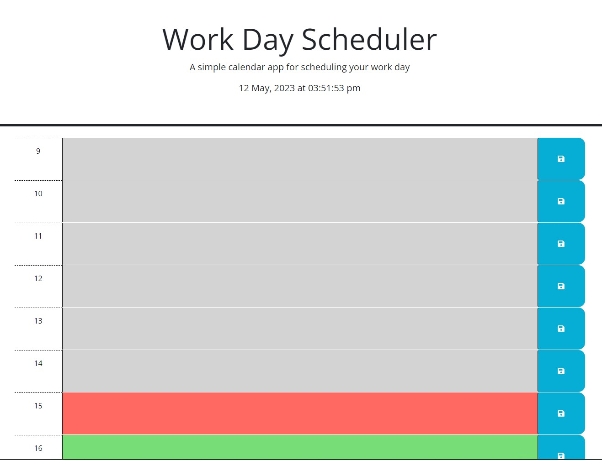

# week-5-work-day-scheduler

## Purpose of Task

Creation of a work day scheduler. There will be time blocks representing the typical hours of a work day (9-5) where the user will be able to save events. This will make use of JavaScript and jQuery to dynamically generate each time block, assign an appropriate class of past, present or future and populate each block with saved events from local storage.

## User Story

```
AS AN employee with a busy schedule
I WANT to add important events to a daily planner
SO THAT I can manage my time effectively
```

## Acceptance Criteria

```
GIVEN I am using a daily planner to create a schedule
WHEN I open the planner
THEN the current day is displayed at the top of the calendar
WHEN I scroll down
THEN I am presented with timeblocks for standard business hours
WHEN I view the timeblocks for that day
THEN each timeblock is color coded to indicate whether it is in the past, present, or future
WHEN I click into a timeblock
THEN I can enter an event
WHEN I click the save button for that timeblock
THEN the text for that event is saved in local storage
WHEN I refresh the page
THEN the saved events persist
```

## Problems Solved

- When the page is loaded the current date and time is displayed at the top of the page
    - This updates every second so that the display is always accurate
- The user is presented with time blocks for a typical working day
- Each time block has the correct background colour relative to the current hour
    - Previous hours have a class of **past** and a background colour of **grey**
    - The current hour has a class of **present** and a background colour of **red**
    - Future hours have a class of **future** and a background colour of **green**
- The user can enter information into a time block and save their input to local storage
- When the page is reloaded, each time block is populated from local storage

## Screenshot



## Deployed Webpage

The published page is available here: https://olivercray.github.io/week-5-work-day-scheduler/